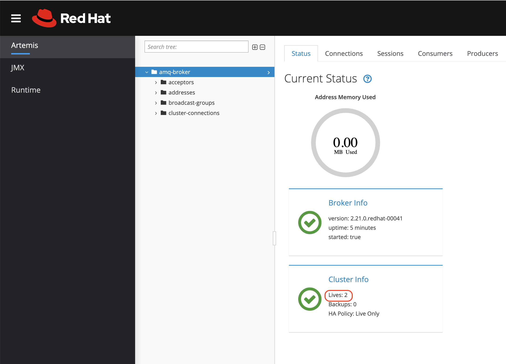

# Procedimiento instalación y configuración Broker AMQ con replicacion multi cluster

## Broker 1

1. Creamos el namespace

```yaml
kind: Project
apiVersion: project.openshift.io/v1
metadata:
  name: pocamqbroker1
```

2. Instalamos operador

Red Hat Integration - AMQ Broker for RHEL 8 (Multiarch) 7.10.2-opr-2+0.1676475747.p provided by Red Hat

3. Creamos la imagen que vamos a usar como `initImage` en el CRD

```yaml
kind: ImageStream
apiVersion: image.openshift.io/v1
metadata:
  name: amqbrokerinitcustom
  namespace: pocamqbroker1
spec:
  lookupPolicy:
    local: false
```

```yaml
kind: BuildConfig
apiVersion: build.openshift.io/v1
metadata:
  name: amqbrokerinitcustom
  namespace: pocamqbroker1
spec:
  nodeSelector: null
  output:
    to:
      kind: ImageStreamTag
      name: 'amqbrokerinitcustom:latest'
  resources: {}
  successfulBuildsHistoryLimit: 5
  failedBuildsHistoryLimit: 5
  strategy:
    type: Docker
    dockerStrategy:
      dockerfilePath: Dockerfile
  postCommit: {}
  source:
    type: Git
    git:
      uri: 'https://github.com/damianlezcano/amqbrokerinitcustom.git'
      ref: 'amq1'
    contextDir: /
  runPolicy: Serial
```
4. Creamos el CRD de Artemis

```yaml
apiVersion: broker.amq.io/v1beta1
kind: ActiveMQArtemis
metadata:
  name: ex-aao
  namespace: pocamqbroker1
spec:
  acceptors:
    - port: 61616
      verifyHost: false
      wantClientAuth: false
      expose: true
      needClientAuth: false
      multicastPrefix: /topic/
      name: stomp
      sslEnabled: false
      sniHost: localhost
      protocols: 'CORE,AMQP,STOMP,HORNETQ,MQTT,OPENWIRE'
      sslProvider: JDK
      anycastPrefix: jms.topic.
      bindToAllInterfaces: true
  adminPassword: redaht01
  adminUser: admin
  connectors:
    - host: ex-aao-stomp-0-svc.pocamqbroker2.svc.cluster.local
      name: broker2-connector
      port: 61616
      sslEnabled: false
  console:
    expose: true
  deploymentPlan:
    size: 1
    initImage: image-registry.openshift-image-registry.svc:5000/pocamqbroker1/amqbrokerinitcustom:latest
    persistenceEnabled: false
    messageMigration: true
    requireLogin: false
    affinity:
      nodeAffinity:
        requiredDuringSchedulingIgnoredDuringExecution:
          nodeSelectorTerms:
            - matchExpressions:
                - key: kubernetes.io/hostname
                  operator: In
                  values:
                    - ip-10-0-206-91
    managementRBACEnabled: true
    journalType: nio
    jolokiaAgentEnabled: false
    image: placeholder
```

_Para este ejemplo no se contaba con 2 cluster de OCP. Por tal motivo se crearon 2 namespaces y en cada uno de ellos se desplego una instancia del broker con un `nodeAffinity` para garantizar que cada broker este en workers separados. Quite la seccion de `nodeAffinity` si cuenta con otro cluster._

---

## Broker 2

1. Creamos el namespace

```yaml
kind: Project
apiVersion: project.openshift.io/v1
metadata:
  name: pocamqbroker2
```

2. Instalamos operador

Red Hat Integration - AMQ Broker for RHEL 8 (Multiarch) 7.10.2-opr-2+0.1676475747.p provided by Red Hat

3. Creamos la imagen que vamos a usar como `initImage` en el CRD

```yaml
kind: ImageStream
apiVersion: image.openshift.io/v1
metadata:
  name: amqbrokerinitcustom
  namespace: pocamqbroker2
spec:
  lookupPolicy:
    local: false
```

```yaml
kind: BuildConfig
apiVersion: build.openshift.io/v1
metadata:
  name: amqbrokerinitcustom
  namespace: pocamqbroker2
spec:
  nodeSelector: null
  output:
    to:
      kind: ImageStreamTag
      name: 'amqbrokerinitcustom:latest'
  resources: {}
  successfulBuildsHistoryLimit: 5
  failedBuildsHistoryLimit: 5
  strategy:
    type: Docker
    dockerStrategy:
      dockerfilePath: Dockerfile
  postCommit: {}
  source:
    type: Git
    git:
      uri: 'https://github.com/damianlezcano/amqbrokerinitcustom.git'
      ref: 'amq2'
    contextDir: /
  runPolicy: Serial
```
4. Creamos el CRD de Artemis

```yaml
apiVersion: broker.amq.io/v1beta1
kind: ActiveMQArtemis
metadata:
  name: ex-aao
  namespace: pocamqbroker2
spec:
  acceptors:
    - port: 61616
      verifyHost: false
      wantClientAuth: false
      expose: true
      needClientAuth: false
      multicastPrefix: /topic/
      name: stomp
      sslEnabled: false
      sniHost: localhost
      protocols: 'CORE,AMQP,STOMP,HORNETQ,MQTT,OPENWIRE'
      sslProvider: JDK
      anycastPrefix: jms.topic.
      bindToAllInterfaces: true
  adminPassword: redaht01
  adminUser: admin
  connectors:
    - host: ex-aao-stomp-0-svc.pocamqbroker1.svc.cluster.local
      name: broker2-connector
      port: 61616
      sslEnabled: false
  console:
    expose: true
  deploymentPlan:
    size: 1
    initImage: image-registry.openshift-image-registry.svc:5000/pocamqbroker2/amqbrokerinitcustom:latest
    persistenceEnabled: false
    messageMigration: true
    requireLogin: false
    affinity:
      nodeAffinity:
        requiredDuringSchedulingIgnoredDuringExecution:
          nodeSelectorTerms:
            - matchExpressions:
                - key: kubernetes.io/hostname
                  operator: In
                  values:
                    - ip-10-0-230-102
    managementRBACEnabled: true
    journalType: nio
    jolokiaAgentEnabled: false
    image: placeholder
```

## Verificacion

Verifiquemos que los nodos del broker conformen el cluster. Para esto ingresemos a la consola del cualquiera de las instancias del broker y verifiquemos en la seccion `Cluster Info` que diga `Lives: 2` como se muestra en la imagen




Producimos un mensaje al `tipic test`

```bash
oc exec ex-aao-ss-0 -n pocamqbroker1 -- /bin/bash /home/jboss/amq-broker/bin/artemis producer --user admin --password redhat01 --url tcp://ex-aao-ss-0:61616 --destination /topic/test --message-count 1
```

Verificamos las colas en ambos brokers

```bash
oc exec ex-aao-ss-0 -n pocamqbroker1 -- /bin/bash /home/jboss/amq-broker/bin/artemis queue stat --user admin --password admin --url tcp://ex-aao-ss-0:61616

oc exec ex-aao-ss-0 -n pocamqbroker2 -- /bin/bash /home/jboss/amq-broker/bin/artemis queue stat --user admin --password admin --url tcp://ex-aao-ss-0:61616
```

Consumimos los mensajes desde cualquier broker
```bash
oc exec ex-aao-ss-0 -n pocamqbroker1 -- /bin/bash /home/jboss/amq-broker/bin/artemis consumer --destination /topic/test  --message-count=1 --url tcp://ex-aao-ss-0:61616

oc exec ex-aao-ss-0 -n pocamqbroker2 -- /bin/bash /home/jboss/amq-broker/bin/artemis consumer --destination /topic/test  --message-count=1 --url tcp://ex-aao-ss-0:61616
```

## Referencias


[](https://access.redhat.com/documentation/en-us/red_hat_amq_broker/7.10/html-single/configuring_amq_broker/index#configuring-fault-tolerant-system-broker-connections-configuring)

[](https://activemq.apache.org/components/artemis/documentation/latest/amqp-broker-connections.html)
